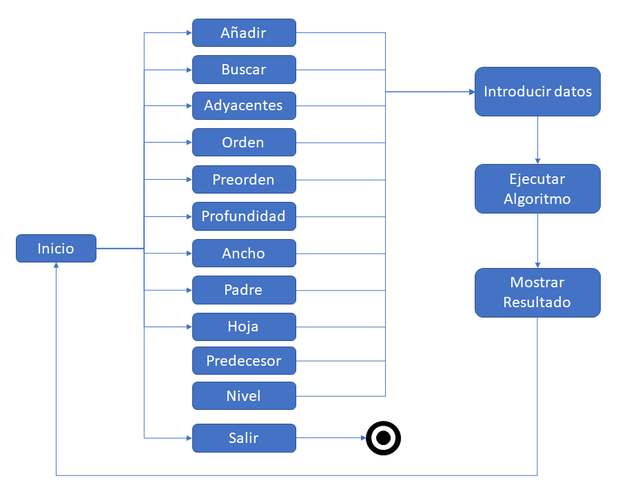

# Tree Algorithms in Python and Prolog

## Universidad Autónoma de Yucatán

### Maestría en Ciencias de la Computación

Programming Paradigms Final Task

### Authors

* Mario Herrera
* Dayan Bravo

## Descripción general del sistema

### Objetivos

El sistema utiliza los lenguajes de programación Python y Prolog para realizar una serie de operaciones sobre un árbol binario. Entre las operaciones que se desarrollaron se encuentran:

* Añadir un nuevo vértice al árbol.
* Determinar si un vértice existe en el árbol.
* Determinar los adyacentes de un vértice determinado.
* Recorridos en orden, preorden, en profundidad y a lo ancho.
* Determinar si un nodo es padre de otro.
* Determinar si un nodo es hoja.
* Determinar si un nodo es predecesor de otro.
* Determinar el nivel de un árbol.

### Documentación Técnica

#### Tree Example


##### Python

```python
tree = Tree(
            12,
            Tree(
                6,
                Tree(
                    2,
                    None,
                    Tree(4)
                ),
                Tree(
                    8,
                    None,
                    Tree(10)
                )
            ),
            Tree(
                14,
                None,
                Tree(
                    18,
                    Tree(16),
                    Tree(20)
                ),
            )
        )
```

##### Prolog

```prolog
tree(
    12, 
    tree(
        6, 
        tree(
            2, 
            nil, 
            tree(
                4, 
                nil, 
                nil
                )
            ), 
        tree(
            8, 
            nil, 
            tree(10, nil, nil)
            )
        ), 
    tree(
        14, 
        nil, 
        tree(
            18, 
            tree(16, nil, nil), 
            tree(20, nil, nil)
        )
    )
)
```

#### Insert Method

##### Python

Este método recibe por parámetros un árbol y un vértice, y devuelve el árbol con el vértice añadido en la posición que le corresponda. El procedimiento es comparar el vértice nuevo con el vértice actual del árbol y moverse hacia la rama izquierda o derecha según corresponda. El procedimiento se repite hasta llegar a la posición correcta del árbol y el vértice nuevo se añade como una hoja en esa posición.

##### Prolog

Este método recibe un vértice y un árbol, y devuelve el árbol con el vértice insertado en la posición que corresponde. El procedimiento consiste en comparar el vértice nuevo con el vértice actual del árbol y moverse hacia la rama izquierda o derecha según corresponda. Se repite este procedimiento hasta llegar a la posición correcta del árbol y el vértice nuevo se añade como una hoja en esa posición.

#### Find Method

##### Python

Este método recibe el valor de un vértice parámetro y devuelve el subarbol que tiene como raiz el nodo encontrado. En caso de no encontrar el nodo, devuelve None. El procedimiento consiste en ir comparando el vértice que se esta buscando con el vértice actual del grafo y moverse hacia la rama derecha o izquierda según corresponda hasta encontrar el vértice buscado o hasta que se llegue a una hoja del árbol y no se haya podido encontrar el vértice.

##### Prolog

Este método busca un vértice en un árbol y lo devuelve en caso de que lo logre encontrar. Como es un árbol binario de búsqueda entonces se busca de manera ordenada preguntando en cada paso si tiene que mover a la izquierda o a la derecha hasta que encuentre el nodo o se quede sin opciones.


### Documentación del Usuario

Cuando el usuario ingresa al sistema se le muestra un menú con todas las opciones disponibles:

1. **Añadir un vértice**: Añade al árbol un nuevo vértice determinado por el usuario
2. **Buscar un vértice**: Busca en el árbol un vértice determinado por el usuario.
3. **Buscar adyacentes a un vértice**: Muestra al usuario los nodos hijos y el padre de un vértice determinado.
4. **Recorrer en orden**: Muestra al usuario la secuencia de valores del árbol ordenados de menor a mayor.
5. **Recorrer en preorden**: Muestra al usuario la secuencia de valores del árbol como si fuera en profundidad pero analisando cada valor en el momento en que lo visita sin esperar a llegar al nivel más profundo del árbol.
6. **Recorrer en profundidad**: Muestra al usuario la secuencia de valores del árbol utilizando el recorrido en profundidad que muestra primero los elementos más profundos de cada rama y por último la raiz.
7. **Recorrer a lo ancho**: Muestra al usuario la secuencia de valores del árbol recorrido por niveles empezando de arriba hacía abajo.
8. **Determinar si un nodo es padre de otro**: Muestra al usuario si un nodo determinado es padre de otro nodo o no, ambos nodos indicados por el usuario.
9. **Determinar si un nodo es hoja**: Muestra al usuario si un nodo determinado es una hoja de árbol o no.
10. **Determinar si un nodo es predecesor de otro**: Muestra al usuario si un nodo se encuentra dentro del subárbol donde la raíz es otro nodo específico.
11. **Determinar el nivel del árbol**: Muestra al usuario cuantos niveles tiene el árbol.
12. **Salir**: Finaliza el programa.

El usuario puede seleccionar la opción que desee y el sistema seguidamente pasará a pedirle al usuario que le proporcione los datos necesarios y por último ejecutará el algoritmo en los lenguajes que estén disponibles.

El siguiente gráfico muestra el proceso de interacción principal del usuario con el sistema, donde se observa que primero se muestran todas las opciones disponibles, luego se pasa a ejecutar los algoritmos tanto en Python como en Prolog si se encuentra implementado en ambos lenguajes. Puedo que el método se encuentre implementado en uno solo de los lenguajes, pero en cualquiera de los dos casos se pasa a pedirle los datos al usario necesarios para ejecutar el algoritmo. Luego se procede a ejecutar el método deseado y por último se le muestra los resultados al usuario y se regresa al inicio del menú para que el usuario seleccione de nuevo la opción que desee.


